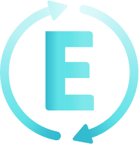

<a name="readme-top"></a>


<!-- PROJECT LOGO -->
<br />
<div align="center">
  <a href="https://gitlab.com/angel.angelov711/EventSync">
    
  </a>

  <h3 align="center">EventSync</h3>

  <p align="center">
    Schedule your events in a feature-rich calendar app
    <br />
    <a href="https://gitlab.com/angel.angelov711/EventSync"><strong>Explore the docs »</strong></a>
  </p>
</div>


<!-- TABLE OF CONTENTS -->
<details>
  <summary>Table of Contents</summary>
  <ol>
    <li>
      <a href="#about-the-project">About The Project</a>
      <ul>
        <li><a href="#built-with">Built With</a></li>
      </ul>
    </li>
    <li>
      <a href="#getting-started">Getting Started</a>
      <ul>
        <li><a href="#installation">Installation</a></li>
      </ul>
    </li>
    <li><a href="#contributing">Contributing</a></li>
    <li><a href="#contact">Contact</a></li>
    <li><a href="#acknowledgments">Acknowledgments</a></li>
  </ol>
</details>


<!-- ABOUT THE PROJECT -->
## About The Project

### Description:
EventSync is a cutting-edge event management application designed to simplify the process of scheduling and organizing events for individuals and teams. With a focus on flexibility and user-friendliness, EventSync empowers users to create and manage events and event series effortlessly. 

EventSync utilizes Firebase as a back-end service offering a reliable data management. There are three main entities:
* User Management: EventSync utilizes Firebase for authentication, offering a secure login and registration system. Users are required to provide essential information, including a unique username, email, phone number, and profile photo.
* Event creation: Events in EventSync are identified by a unique ID and feature essential details such as a title, start and end dates, and hours. Events can be part of recurring series or one-time occurrences, and they can be set as either public or private. Additionally, events can include a location with map integration and a concise description.
* Social Features: Easily find and add friends within the app. Strengthen your social circle and stay connected with like-minded individuals.Invite Friends to Events: Hosting an exciting event? Invite your friends with just a few taps. They'll receive notifications about your event and can RSVP to join the fun.


You can access the live version of the project by following this link:

[](https://event-sync.vercel.app/)

Click the badge above or [here](https://event-sync.vercel.app/) to explore the application online.


### Built With

These are the the main technologies used for the creation of the EventSync app:

* [![Javascript]][Javascript-url]
* [![React][React.js]][React-url]
* [![HTML][HTML]][HTML-url]
* [![CSS][CSS]][CSS-url]
* [![Tailwind][Tailwind]][Tailwindcss-url]
* <a href="https://firebase.google.com/?gad=1&gclid=Cj0KCQjw2qKmBhCfARIsAFy8buJpmcsVlLSlOLxynVWpM_INCIau6stZ_d7c05Z1xpz3lpb95c3QNC0aAhvuEALw_wcB&gclsrc=aw.ds">
    
  </a>


<!-- GETTING STARTED -->
## Getting Started

Below are the main instruction of how to get, install, run and use the app locally

### Installation

_Below are the steps required to get, install, run and use the project._

1. Clone the repo
   ```sh
   git clone https://gitlab.com/angel.angelov711/EventSync.git
   ```
2. Install NPM packages
   ```sh
   npm install
   ```
3. To run the project locally, execute in the terminal
   ```js
   npm run dev
   ```


<p align="right">(<a href="#readme-top">back to top</a>)</p>

<!-- CONTRIBUTING -->
## Contributing

Contributions are what make the open source community such an amazing place to learn, inspire, and create. Any contributions you make are **greatly appreciated**.

If you have a suggestion that would make this better, please fork the repo and create a pull request.Don't forget to give the project a star! Thanks again!

1. Fork the Project
2. Make your changes
3. Make a pull request to get latest changes ( `git pull` )
4. Commit your changes ( `git push` )

<p align="right">(<a href="#readme-top">back to top</a>)</p>


<!-- CONTACT -->
## Contact

* Angel Angelov - [gitLab](https://github.com/angel.angelov711) - a.krasimirov35@gmail.com

Project Link: [EventSync](https://github.com/angel.angelov711/EventSync)

<p align="right">(<a href="#readme-top">back to top</a>)</p>


<!-- ACKNOWLEDGMENTS -->
## Acknowledgments

Useful resources you would find helpful and like to give credit to. We've included a few of our favorites to kick things off!

* [Choose an Open Source License](https://choosealicense.com)
* [Firebase Documentation - Realtime Database](https://firebase.google.com/docs/database)
* [ESLint](https://eslint.org/)
* [Tailwind Components](https://flowbite.com/)
* [Malven's Flexbox Cheatsheet](https://flexbox.malven.co/)
* [Img Shields](https://shields.io)
* [Font Awesome](https://fontawesome.com)
* [React Icons](https://react-icons.github.io/react-icons/search)
* [React country flags](https://www.npmjs.com/package/react-country-flag)
* [React quill](https://www.npmjs.com/package/react-quill)
* [React hot toast](https://react-hot-toast.com/)
* [Yup - validations](https://www.npmjs.com/package/yup)
* [Recharts](https://recharts.org/en-US/)

<p align="right">(<a href="#readme-top">back to top</a>)</p>


<!-- MARKDOWN LINKS & IMAGES -->
<!-- https://www.markdownguide.org/basic-syntax/#reference-style-links -->
[contributors-shield]: https://img.shields.io/github/contributors/othneildrew/Best-README-Template.svg?style=for-the-badge
[contributors-url]: https://github.com/othneildrew/Best-README-Template/graphs/contributors
[forks-shield]: https://img.shields.io/github/forks/othneildrew/Best-README-Template.svg?style=for-the-badge
[forks-url]: https://github.com/othneildrew/Best-README-Template/network/members
[stars-shield]: https://img.shields.io/github/stars/othneildrew/Best-README-Template.svg?style=for-the-badge
[stars-url]: https://github.com/othneildrew/Best-README-Template/stargazers
[issues-shield]: https://img.shields.io/github/issues/othneildrew/Best-README-Template.svg?style=for-the-badge
[issues-url]: https://github.com/othneildrew/Best-README-Template/issues
[license-shield]: https://img.shields.io/github/license/othneildrew/Best-README-Template.svg?style=for-the-badge
[license-url]: https://github.com/othneildrew/Best-README-Template/blob/master/LICENSE.txt
[linkedin-shield]: https://img.shields.io/badge/-LinkedIn-black.svg?style=for-the-badge&logo=linkedin&colorB=555
[linkedin-url]: https://linkedin.com/in/othneildrew
[product-screenshot]: src/assets/project-web-screenshot.JPG
[Javascript]: https://img.shields.io/badge/JavaScript-323330?style=for-the-badge&logo=javascript&logoColor=F7DF1E
[Javascript-url]: https://en.wikipedia.org/wiki/JavaScript
[React.js]: https://img.shields.io/badge/React-20232A?style=for-the-badge&logo=react&logoColor=61DAFB
[React-url]: https://reactjs.org/
[HTML]: https://img.shields.io/badge/HTML5-E34F26?style=for-the-badge&logo=html5&logoColor=white
[HTML-url]: https://www.w3.org/
[CSS]: https://img.shields.io/badge/CSS3-1572B6?style=for-the-badge&logo=css3&logoColor=white
[CSS-url]: https://www.w3.org/
[Tailwind]: https://img.shields.io/badge/Tailwind_CSS-38B2AC?style=for-the-badge&logo=tailwind-css&logoColor=white
[Tailwindcss-url]: https://tailwindcss.com/
